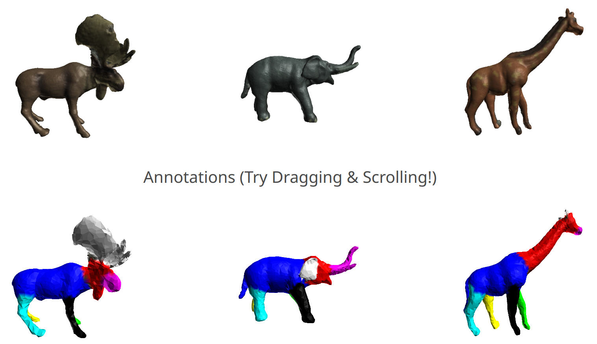
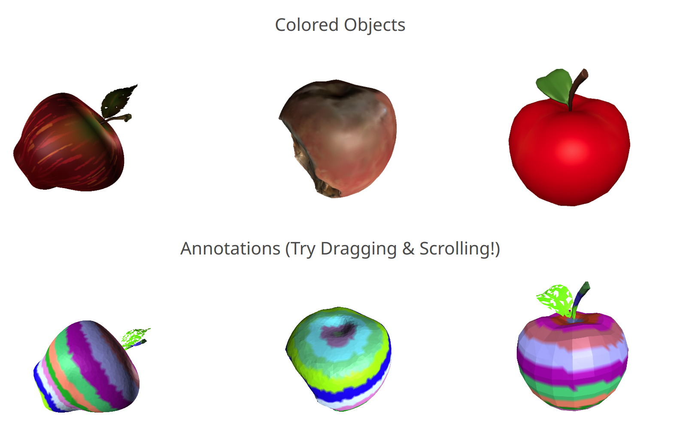

# <span style="color:#FF6347">Dense</span><span style="color:magenta">Matcher</span>  Learning 3D Semantic <span style="color:#3399FF">Correspondence</span> for Category-Level Manipulation from One Demo
<a></a>
We release the first 3D shape matching dataset with 1. <b>colored</b> meshes 2. <b>diverse</b> categories with large intra-category <b>variations</b>. We provide the inference code for now, and will release the benchmark evaluation code soon.
### [DenseCorr3D Dataset](https://drive.google.com/file/d/1bpgsNu8JewRafhdRN4woQL7ObQtfgcpu/view?usp=sharing) | [Model Checkpoints](https://drive.google.com/file/d/1rVNixF4AYYQgmQ-biJaLtbT_wGHPXkCf/view?usp=sharing)

## Installation
We provide a script for installation, tested on Ubuntu 20.04.
1. Install [cuda 11.8](https://developer.nvidia.com/cuda-11-8-0-download-archive)
2. Clone the repo with 
```
git clone https://github.com/JunzheJosephZhu/DenseMatcher.git
cd DenseMatcher
```
3. Create a conda environment and install dependencies: 
```
conda create -n "densematcher" python=3.9
conda activate densematcher
bash setup.sh
```

## Running Example Notebook(Release progress)
Download model checkpoints and dataset from the links above. Unzip the dataset into *DenseCorr3D/* and the model into *checkpoints/* under your working folder.

Activate densematcher environment, run ```jupyter notebook``` and select *example.ipynb*

## Dataset Format
Our dataset consists of 24 categories containing 599 objects in total. Each object has 4 associated files:
1. color_mesh.obj: This file contains the original colored mesh used for <b>rendering</b> posed images, for methods that depend on multiview 2D models
2. simple_mesh.obj: This file contains a simplified version of the original mesh, obtained through remeshing. Each mesh has ~2000 vertices. This is for methods that utilize geometry information (e.g. PointNet/DiffusionNet)
3. groups.txt: The file contains <b>Dense</b> correspodence annotation labels. Each line consists of vertex indices from one semantic group, where all vertices share the same semantic meaning. For two objects from the same categories, they have the same number of groups with 1-on-1 correspondence.   
4. groups_visualization.obj: This is only for visualization. View it with [Open3D Viewer](https://www.open3d.org/download/) or [Meshlab](https://www.meshlab.net/) (or any 3D viewer that can show vertex colors) to get a better understanding of correspondence annotations.

The file splits are provided in *train_files.txt, val_files.txt, test_files.txt*

## Checkpoints
The model checkpoints contain weights for 
1. Aggregation Network(aggrenet) used in ["Telling Left from Right"](https://telling-left-from-right.github.io/), for fusing the features from Stable Diffusion and DINOv2 branches of [SD-DINO](https://sd-complements-dino.github.io/). The input sizes can be 384/512, and output feature sizes will be down by a factor of $16^2$.
2. 2D Feature Upsampler layer weights from [Featup](https://openreview.net/forum?id=GkJiNn2QDF), for upsampling the outputs of aggregation network back to the input image size.
3. DiffusionNet weights for our 3D feature refiner "neck". We currently only provide the version that works with 384 image size, but will release the 512 version very soon.

After unzipping, your folder should look like
```
-> % tree ./checkpoints -L 1
./checkpoints
├── exp_mvmatcher_imsize=384_width=512_nviews=3x1_wrecon=10.0_cutprob=0.5_blocks=8_release_jitter=0.0
├── featup_imsize=384_channelnorm=False_unitnorm=False_rotinv=True
├── featup_imsize=512_channelnorm=False_unitnorm=False_rotinv=True
└── SDDINO_weights
```